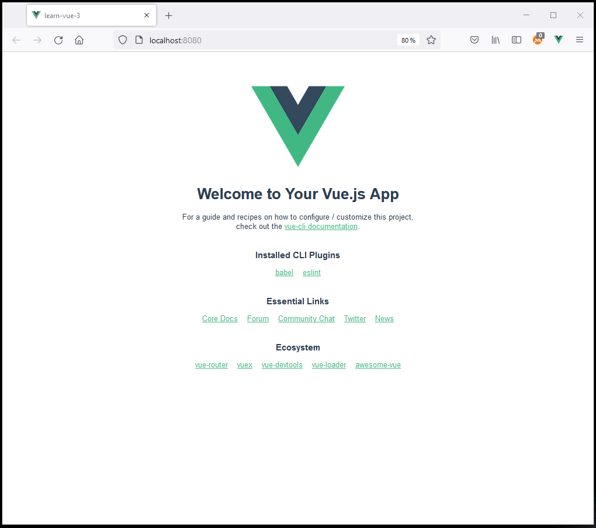

# Learning Vue3 framework

A progressive introduction to Vue3 framework

## Prerequisites

* Node JS installed

* Vue cli installed: `npm install @vue/cli`

## Setting up the project

* Go to a directory that will contain your project's folder
* `vue create learn-vue-3`
* Follow the step-by-step wizard with the default proposals
* Open the newly created folder in your favorite IDE
* In a terminal, run: `npm run serve`
* Go to your browser and load http://localhost:8080/

You are up and ready to start...

## What are .vue files ?

A `.vue` file is a custom format that uses HTML-like syntax to describe a portion of 
the UI

Each `.vue` file consists of three types of top-level language blocks
* `<template></template>`
* ``
* ``

The `template` block is like the HTML of your UI

The `script` block is where the logic and functionality of your application can be 
maintained

The `style` block is where you specify the CSS styles related to the markup in the
template block

## Components

A `.vue` file is called a single file component (SFC)

As a beginner, there is a lot to learn without having to worry about the component
architecture

## Table of content

* [Binding text](./docs/binding_text.md)
* [Binding HTML](./docs/binding_html.md)
* [Binding attributes](./docs/binding_attributes.md)